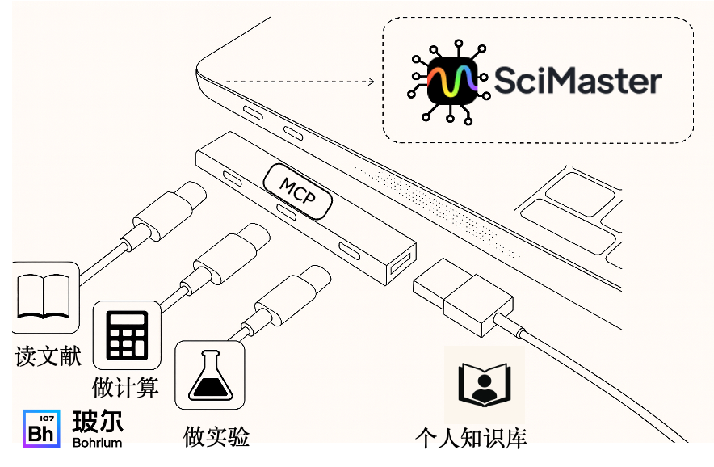
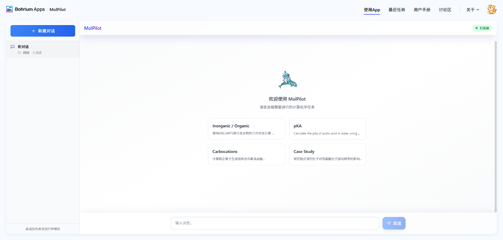

# Bohrium Science Agent SDK

**让科研软件快速升级为 AI 助手 —— 三步实现智能化转型**

## 📖 项目简介

想要开发一款强大高效、美观易用的软件应用绝非易事。开发者往往需要从 0 开始学习软件开发的众多知识，编写前端界面、部署计算资源、开展任务管理，还有众多例如域名申请、资质认定、平台备案、宣传推广等事务性工作。高门槛、难维护、缺指导的开发体验大大打击了开发者的积极性。

为此，玻尔平台推出了 **bohr-agent-sdk 科研智能体开发套件**，让 AI 系统真正执行科学专业任务，帮助开发者快速构建自己的专属科研智能体。通过三步流程——**调用 MCP 工具、编排 Agent 流程、部署发布服务**——任何科研软件都能快速升级为 AI 助手。

## ✨ 核心特性

### 🎯 智能任务管理：简化开发，标准输出
通过装饰器模式，几行注解就能将科研计算程序快速转化为 MCP 标准服务。内置应用模版，让原本分散的科研代码成为标准化、可复用的智能组件。

### 🔧 多后端框架
支持 Google ADK、Langraph、Camel 等主流 Agent 开放框架，为熟悉各个技术栈的开发者提供开放选择。

### ☁️ 灵活计算部署：本地开发，云端生产
双模式架构支持开发与生产的无缝衔接。本地环境用于快速迭代和功能验证，玻尔云端 GPU 集群承载生产级计算任务。SDK 自动管理任务调度、状态监控、结果回收的完整流程，内置文件传输机制处理大规模数据的上传下载。开发者专注于核心算法实现，基础设施管理完全自动化。

### 🖼️ 可视化交互界面：专业呈现，直观操作
基于 React 现代框架，一键部署功能完备的 Web 应用。内置 3D 分子可视化引擎，支持多种结构格式和渲染模式，实现分子结构的交互式展示。实时数据同步保证计算状态即时更新，多会话管理支持并行任务处理。集成文件管理、项目切换、权限控制等企业级功能。将命令行工具升级为专业的可视化应用，大幅提升用户体验和工具可用性。

## 🖼️ 界面展示

### 科研计算主控台

*强大的科研计算任务管理与监控平台*

### 可视化交互界面

*现代化的 Web 应用界面，提供直观的操作体验*

## 🚀 快速开始

### 安装

```bash
pip install bohr-agent-sdk -i https://pypi.org/simple --upgrade
```

### 三步构建您的科研智能体

#### 第一步：获取项目模板

```bash
# 获取计算类项目模板
dp-agent fetch scaffolding --type=calculation

# 获取设备控制类项目模板
dp-agent fetch scaffolding --type=device

# 获取配置文件
dp-agent fetch config
```

#### 第二步：开发您的智能体

**实验室模式开发示例**

```python
from typing import Dict, TypedDict
from dp.agent.device.device import Device, action, BaseParams, SuccessResult

class TakePictureParams(BaseParams):
    """拍照参数定义"""
    horizontal_width: str  # 图片水平宽度

class PictureData(TypedDict):
    """照片数据结构"""
    image_id: str

class PictureResult(SuccessResult):
    """拍照结果"""
    data: PictureData

class MyDevice(Device):
    """自定义设备类"""
    device_name = "my_device"

    @action("take_picture")
    def take_picture(self, params: TakePictureParams) -> PictureResult:
        """
        执行拍照动作

        通过 @action 装饰器，自动将此方法注册为 MCP 标准服务
        """
        hw = params.get("horizontal_width", "default")
        # 执行实际的设备控制逻辑
        return PictureResult(
            message=f"Picture taken with {self.device_name}",
            data={"image_id": "image_123"}
        )
```

**云端模式开发示例**

```python
"""
基于 MCP 协议的云端设备控制示例
"""
import signal
import sys
from dp.agent.cloud import mcp, get_mqtt_cloud_instance
from dp.agent.device.device import TescanDevice, register_mcp_tools

def signal_handler(sig, frame):
    """优雅关闭处理"""
    print("Shutting down...")
    get_mqtt_cloud_instance().stop()
    sys.exit(0)

def main():
    """启动云端服务"""
    print("Starting Tescan Device Twin Cloud Services...")

    # 注册信号处理
    signal.signal(signal.SIGINT, signal_handler)

    # 创建设备实例
    device = TescanDevice(mcp, device)

    # 自动注册设备工具到 MCP 服务器
    # register_mcp_tools 通过 Python 自省机制实现自动注册
    register_mcp_tools(device)

    # 启动 MCP 服务器
    print("Starting MCP server...")
    mcp.run(transport="sse")

if __name__ == "__main__":
    main()
```

#### 第三步：运行和部署

```bash
# 本地实验室环境
dp-agent run tool device

# 云端计算环境
dp-agent run tool cloud

# 科学计算模式
dp-agent run tool calculation

# 启动智能体（带 Web UI）
dp-agent run agent --config 


# 调试模式
dp-agent run debug
```

## 🏗️ 项目结构

运行 `dp-agent fetch scaffolding` 后，您将获得标准化的项目结构：

```
your-project/
├── lab/                    # 实验室模式
│   ├── __init__.py
│   └── tescan_device.py    # 设备控制实现
├── cloud/                  # 云端模式
│   ├── __init__.py
│   └── mcp_server.py       # MCP 服务实现
├── calculation/            # 计算模式
│   └── __init__.py
├── .env                    # 环境配置
└── main.py                 # 主程序入口
```

## ⚙️ 配置说明

在 `.env` 文件中配置必要的环境变量：

```bash
# MQTT 连接配置
MQTT_INSTANCE_ID=your_instance_id
MQTT_ENDPOINT=your_endpoint
MQTT_DEVICE_ID=your_device_id
MQTT_GROUP_ID=your_group_id
MQTT_AK=your_access_key
MQTT_SK=your_secret_key

# 计算资源配置
BOHRIUM_USERNAME=your_username
BOHRIUM_PASSWORD=your_password
```

注意：`dp-agent fetch config` 命令会自动下载配置文件并替换动态变量（如 MQTT_DEVICE_ID）。出于安全考虑，此功能仅在内网环境可用。

## 🎯 应用场景

- **材料科学计算**：分子动力学模拟、第一性原理计算
- **生物信息分析**：基因序列分析、蛋白质结构预测
- **实验设备控制**：电子显微镜、X 射线衍射仪等科研设备的智能化控制
- **数据处理流程**：自动化数据清洗、分析和可视化
- **机器学习训练**：模型训练、超参数优化、结果评估

## 🔧 高级功能

### 文件管理

```bash
# 上传文件到云端
dp-agent artifact upload <path>

# 下载云端文件
dp-agent artifact download <artifact_id>
```

### 任务监控

SDK 提供实时任务状态监控，支持：
- 任务队列管理
- 计算资源调度
- 结果自动回传
- 异常处理和重试机制

## 📚 文档与支持

- 📖 [详细文档](https://dptechnology.feishu.cn/wiki/ZSj9wbLJEiwdNek0Iu7cKsFanuW)

## 🏢 关于我们

Bohrium Science Agent SDK 由 DP Technology 开发维护，致力于为科研工作者提供强大的 AI 辅助工具，加速科学发现进程。

---

**© 2025 DP Technology. 让 AI 驱动科学创新。**